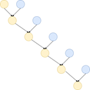

# Teams Agent
This is a proof of concept for how an LLM can be used to maintain the state of a Teams chat, 
by incrementally incorporating newer messages in a running summary, in constant space.

## How to run
.env:
```shell
OPENAI_API_KEY=sk-proj-XXXXXX #dummy key, when using local API
ACCESS_TOKEN=eyJXXXXX #Graph API token that you copy after logging in to https://developer.microsoft.com/en-us/graph/graph-explorer
CHAT_ID=19:91306XXXXXXXXX #chat id that you select from https://graph.microsoft.com/beta/me/chats
```

Feel free to change the baseUrl and the model name to match your setup. But if you use a different
local model, you should modify the token calculation as needed. The code currently uses the 
`llama3-tokenizer-js` tokenizer which matches the model being used.

## The setting
You are working on a project and communicate with your colleagues through a Teams chat. You wish you could employ 
the powers of A.I. to help you keep track of things, but the chat has hundreds of messages, and more are added every 
day. Clearly some form of compression of information is in order, and the fact that external APIs cannot be used, 
makes the situation worse, as the context window can only be 2048 tokens for the local “Llama 3 8B Instruct” 
instance you will be using.

## Some Teams API mechanics
I used the Graph Explorer to experiment with Graph API calls, but the calls I needed were not listed in the sidebar. 
By far the most helpful functionality of the Graph Explorer was to copy the access token easily, to use as the 
Bearer token in the HTTP calls. To find the intended chat, one can list chats using 
https://graph.microsoft.com/beta/me/chats. Then, its messages can be retrieved using the chat ID in 
https://graph.microsoft.com/beta/chats/${chat_id}/messages?${parameters} . The parameters referenced in the 
URL are, for a specific timestamp: 
`$orderby=lastModifiedDateTime%20desc&$filter=lastModifiedDateTime%20gt%202024-10-21T11:58:44.086Z`, 
where the 
timestamp will be the “lastModifiedDateTime” of the last message retrieved the previous time around. The actual 
messages will not be kept, just the timestamp, to serve as a filter to retrieve newer messages.

## Folding
The idea behind this implementation is simple: Instead of working with an ever-growing list of messages, an LLM is 
used to create and maintain a concise summary of the main topics, issues and general state of the chat, and a 
“foldl” operation will be used to enhance/modify it as new messages are posted. In this way, constant space is used, 
no matter how many total messages are in the actual chat.

In the image, the amber blobs are the evolving summaries (only the last one is kept around) and the blue blobs form 
the stream of messages. The top left amber blob is the empty summary. Producing the summary is very costly (on the 
order of many minutes on my laptop!) so each blob is not a single message, but all newer messages that are fetched 
(bounded by the limit of 2048 total tokens for the whole prompt).



One more detail is that the first summary must be produced with enough total information to make sense. Adding 
messages one by one to a “meaty” summary, may be inefficient, but will produce a sightly modified summary that is 
correct. While summarizing a single message and then incrementally adding one message at the time has the potential 
to pollute the summary with meaningless content. Not all messages in a group chat are information-dense! Chit-chat, 
pleasantries, jokes and such, will be ignored, as far as I have seen, when combined with a summary that has real 
information. I believe that they will take center stage if the initial summary is based off them.

## Prompt construction
There are two prompt templates, one for the first time:
```
Please read the following dialog and list the main topics succinctly.
Are there any outstanding issues? Is everyone agreeing? Does anyone have outstanding tasks?
People are tagged by the use of the <at> HTML element.

${messageText}}
```

And one for the subsequent times, when the current summary exists:
```
Please read the (1) summary ("SUMMARY") of previous dialog, and (2) following dialog ("DIALOG") and list the main topics succinctly.
Are there any outstanding issues? Is everyone agreeing? Does anyone have outstanding tasks?
People are tagged by the use of the <at> HTML element.

SUMMARY
${summary}

DIALOG
${messageText}
```

(The thing about the <at> element is particular to Teams) As you can see, the empty summary is ignored, but the 
“folded” function is always from Summary and Messages to Summary.

Messages are formatted as a dialog.
```typescript
let texts = messages.map(m => `${m.from.user.displayName}: ${m.body.content}`);
const messageText = texts.join('\n\n');
```
The local API (I’m using GPT4All) produces a new summary which can take the place of the old one (yes, retaining the 
description on top and the warning at the bottom, it works fine).

## Persistent state
Each run reads and writes file `state.json`. If it is missing, the system is initialized by creating a
first-time summary from as many of the latest messages as fit within 2028 tokens. If it exists, the
`summary` and the `lastModifiedDateTime` are initialized accordingly. At the end of the run, the
resulting `summary` and the `lastModifiedDateTime` are written to the same file, to be used for the
next run.

## Open questions
Creating and updating a summary does not amount exactly to keeping a constant-size state. To do that,
one would need to forget old and state information. Or else the summary would accumulate every matter
ever being discussed in the chat.
